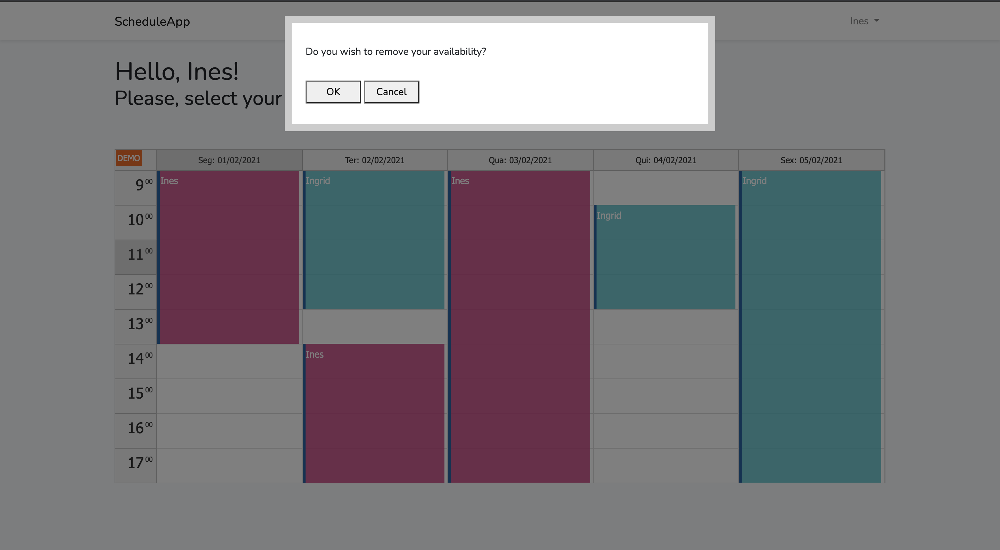

# xgeeks tech assignment

## Install and configure Laravel 8

### Getting Started (macOS)

1. Install Docker (https://www.docker.com/products/docker-desktop)
2. To create a new Laravel application, in a directory called "example", it is necessary to run the following command in the terminal:
```
    - curl -s https://laravel.build/example-app | bash
```
3. After the project has been created, you can navigate to the application directory and start Laravel Sail. Laravel Sail provides a simple command-line interface for interacting with Laravel's default Docker configuration:

```
 cd example-app
./vendor/bin/sail up
```

The first time you run the Sail up command, Sail's application containers will be built on your machine. This could take several minutes. Don't worry, subsequent attempts to start Sail will be much faster.

Once the application's Docker containers have been started, you can access the application in your web browser at: http://localhost.

### Environment Configuration

Laravel's default .env file contains some common configuration values that may differ based on whether your application is running locally or on a production web server. These values are then retrieved from various Laravel configuration files within the config directory using Laravel's env function.

You can, for example, modify your app's name or your app's URL in `.env` file:

```
APP_NAME="MyApp"

APP_URL=http://example.test
```

Also in ```.env``` file you can change your Database connection options, such as the DB username or password. In this case you will use sqlite. For that, go to your ```.env```file and change your default database configuration to the following:

```
DB_CONNECTION=sqlite
DB_HOST=127.0.0.1
DB_PORT=3306
DB_USERNAME=root
DB_PASSWORD=root
DB_FOREIGN_KEYS=true
```

### Install ReactJS in Laravel 8

#### Install laravel/ui

To install React in Laravel with Bootstrap 4, we will use laravel/ui package. This is an official package that offers a login and registration user interface scaffolding for React, Vue and jQuery in Laravel project.
To install this package, run the command below:

```
composer require laravel/ui
```
#### Install React in Laravel

After you have installed the composer UI package, you have to run the given below command to install the React in Laravel:

```
php artisan ui react
```

#### Install Required Packages

By default, Laravel uses Node package manager (NPM) to install the frontend packages. If it's not installed, you can install it with the following command:

```
npm install
```

Then, you just need to use the ```preset``` command with the ```react``` option:

```
php artisan preset react
```

To install ```Web-vitals``` package, which you may need for doing some performance tests, you should type in terminal the follow command:

```
npm install web-vitals
```

For this particular project, you also need to install ```DayPilot``` package, for making a Calendar using ReactJS, with the command bellow:
```
npm install --save https://npm.daypilot.org/daypilot-pro-react/trial/2020.4.4766.tar.gz
```

#### Compile

Once the packages are installed, you can use the ```npm run dev``` command to compile your assets:

```
npm run dev
```

After your code have been compiled, and the necessary changes on your code done, you just need to go to your browser and check your localhost.


---

## About the app

### Database

As previously mentioned, the database connection to the app is made through sqlite.
In the database, you can find 5 different tables:
<ol>
<li> <b>events</b>: where are stored the description, the start date, the end date and the backgroud color of events crerated by the interviewers in the schedule;</li>
<li> <b> users</b>: where are stored the interviewers accounts info such as their names, emails and encrypted passwords; </li>
<li> <b> failed_jobs</b>: this is a laravel's default table. It specifies the maximum number of times a job should be attempted. After a job has exceeded this number of attempts, it will be inserted into this table;</li>
<li> <b>migrations</b>: this is a laravel's default table. It keeps a record of all migrations done;</li>
<li> <b>password_resets</b>: this is a laravel's default table. It provides a way for users to reset their forgotten passwords. </li>
</ol>

### Accounts

#### Register and Login

You can create an account by clicking in the "Register" option in the login page, as we can see in the image bellow:


Then, when you just need to complete all the required fields:

<ul>

<li> <b>Name</b>: it must be a string with a maximum of 255 characters;
<li> <b>E-mail Address</b>: it must be an unique email type string (must contain a "@" and a ".") with a maximum of 255 characters;
<li> <b>Password</b>: it must be a string with a minumum of 8 characters;
<li> <b>Confirm Password</b>: it must be the same as the "Password" field.

</ul>


There are 3 accounts created for <b> testing purposes </b>: Ingrid's, Ines's and Root account:

<ul>

<li> <b> Ingrid's account </b>: this account have the email <i>ingrid@recruiter.com</i> and the password <i>ingrid123456789</i>;
<li> <b> Ines's account </b>: this account have the email <i>ines@recruiter.com</i> and the password <i>ines123456789</i>;
<li> <b> Root account </b>: this is a root account. It has the email <i>root@recruiter.com</i> and the password <i>root123456789</i>.
</ul>

As a recruiter, you can only create or delete your own events, on the other hand, as a root, you can add or delete all the events in the schedule.

Someone that doesn't have an account can also access the schedule by <b>login as a guest</b>. This person can only <b>see</b> the schedule, not being able to make any changes to it. 

### Schedule availability 

It is not possible for any recruiters (neither root) to schedule 2 different events (or interviews, in this case) at the same time, on the same day.


As a guest, you have to mention you availability through the email indicated above the filled schedule.


### Events

#### Add

You can make an event (in this case, an interview availability) by dragging your mouse through the respective free hours on the schedule and automatically your name will appear on the event.
After the event is created, you can delete it at any time.


#### Delete

You can delete one of yours event by selecting it. Only the root has the possibility to delete any event made by all recruiters (as mentioned above).

